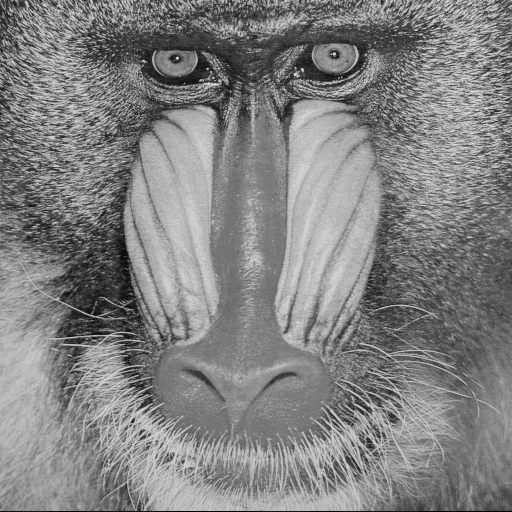
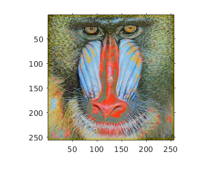
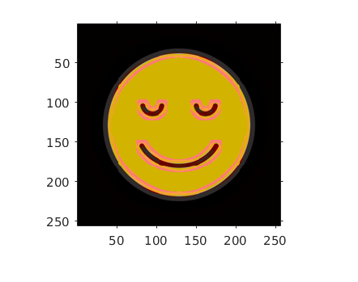
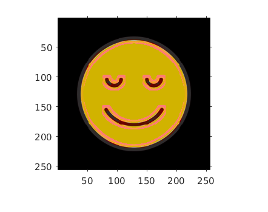

# Automatic Image Colorization
This repository contains the code for our course project for CS663 - Fundamentals of Digital Image Processing at IIT Bombay. We implemented the following paper/report: http://cs229.stanford.edu/proj2013/KabirzadehSousaBlaes-AutomaticColorizationOfGrayscaleImages.pdf. The published code was written in Python using `OpenCV`, `scikit-learn` and `pygco`. We were unable to execute it since some of the functions were outdated. We have coded our implementation in MATLAB.

### Team
* Utkarsh Gupta (@Ug48)
* Yash Shah (@ys1998)

## Procedure
See the [report](report.pdf).

## Results
### 1. Using SVMs followed by Graph Cut Optimized Labelling
For details see the [report](report.pdf).

### 2. Using k-Nearest Neighbor Search
In order to incorporate kNN search into our algorithm, we had to make the following changes - (1) remove quantization of color space, (2) replace SVM classifiers with a *kNN search*, (3) remove position-based features from the feature vectors and (4) replace the graph-cut labeling algorithm with a weighted average in *a-b* space. We were able to get significantly better results. Some of them are shown below:

**(1) Same image used as reference and test image**

**(2) Different images used as reference and test image**

**(3) Multiple reference images**

